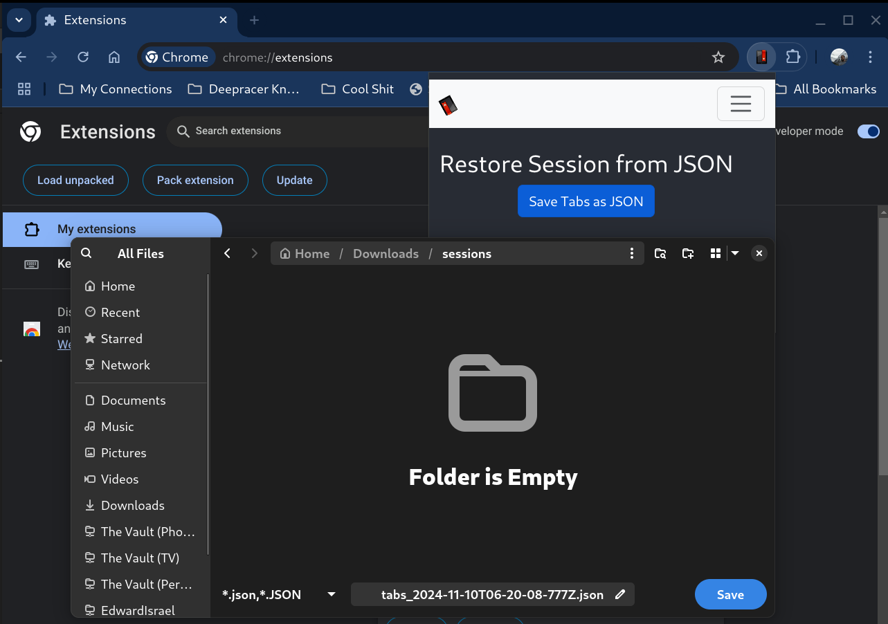
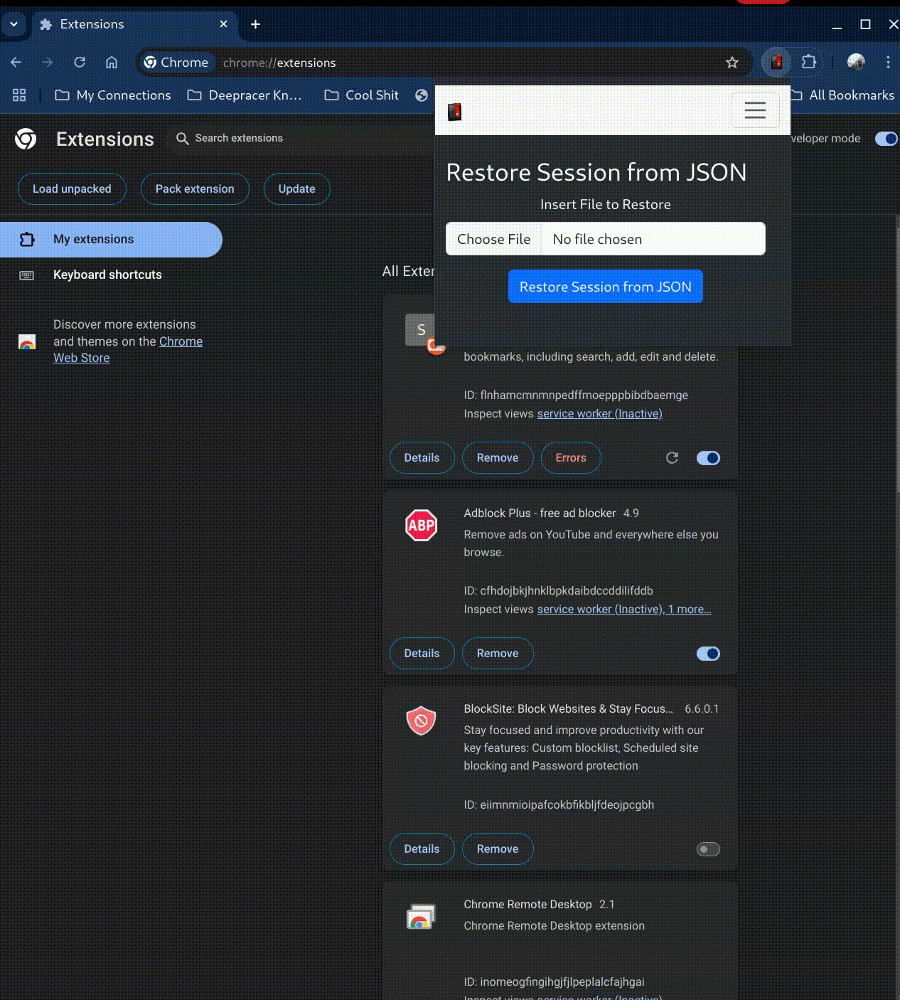

# MyBookmarkSession

**[MyBookmarkSession]** is a Chrome browser extension designed to transfer browser current session to other browser extensions. It is built with React and interacts with the chrome runtime engine to provide information and allow for creation of tabs.

---

## Features

- **Easy to use UI**: Designed with React.js and Bootstrap to allow for easy to use UI and further iterate and develop more features."
- **Save Tabs**: Describe the first feature, e.g., "Blocks ads and trackers for a faster, safer browsing experience."
- **Restore Session**: Describe the second feature, e.g., "Offers a customizable dashboard with shortcuts to your favorite websites."

---

## To run the Development Environment (A Work in Progress)

The current implementation is only in the development stage and requires the following steps.

0. **Clone**: Clone the repository (with HTTPS)

```bash
git clone https://github.com/motethansen/bookmark_extension
```

1. **Download Node.js**: Download the latest version of [Node.js](https://nodejs.org/en/download/package-manager) and Node Package Manager (NPM)

2. **Install**: Run the Installation script

```bash
npm ci
```

3. **Build**: Run the Build script

```bash
npm run build
```

4. **Install the Extension in Chrome**: To install the extension in chrome kindly go to extensions section either by clicking on the top right or typing chrome://extensions in the url bar. Once in there you can find the [Load Unpacked](./docs/loadunpacked.png) option on the top left.

5. **Point to manifest.json**: Once you click and open the file browser kindly to go your build folder and point to the manifest.json to load the extension. Now the extension has been loaded into the screen.

---

<!-- 1. **Download**: Go to the [Chrome Web Store](https://chrome.google.com/webstore/) and search for "Extension Name" or [click here to download](#) (link this to your Chrome Web Store page).
2. **Install**: Click on the "Add to Chrome" button and then "Add extension" to confirm.
3. **Activate**: The extension will appear as an icon in the top-right corner of your browser. Click the icon to configure your settings. -->

## Usage (When we finish uploading to the chrome web store)

1. **Activate Extension**: Click the extension icon next to your browser's address bar to access its features.
2. **Settings**: Customize your preferences through the extension's settings page, available by clicking the gear icon (if applicable).
3. **Shortcuts**: Use keyboard shortcuts for quick access (describe any keyboard shortcuts if implemented).
4. **Tips**: Describe any important tips for optimal usage.

---

## Screenshots

- **Saving Session**: The overall is a very simple interface with two main key functions such as saving a browser session into a JSON file and restoring a file.
  

- **How to Restore Session**: Its very simple all you have to do is upload the json file that was retrieved and then chrome will create a new window that will contain all the tabs restored.
  

---

## Permissions

This extension requires the following permissions:

- **Browser Permissions**: The extension will require permission to access the browser storage features to allow downloading and uploading of browser sessions."
- **Tab Information**: It will read your current session to store that information in a JSON file for you to downlaod and transfer to another browser."

Note: Your privacy and data security are important to us. We only request permissions that are essential for the extension to function.

---

## Contributing

We welcome contributions from the community. Here's how you can get involved:

1. **Fork the repository**: Make a copy of the project on your account.
2. **Make your changes**: Implement new features or fix bugs.
3. **Submit a pull request**: Once your changes are ready, submit a pull request for review.

For major changes, please open an issue first to discuss what you would like to change.

---

## Support

If you have any issues or questions:

- **Report Bugs**: Use the [GitHub issue tracker](https://github.com/motethansen/bookmark_extension/issues) to report any problems or feature requests.

---

## Roadmap

Planned updates and features include:

The next features for this browser extension are:

- [ ] CI/CD Pipeline to build, test and upload extension to all web stores.
- [ ] Firefox compatible extension
- [ ] Test and fix with Brave and Arc
- [ ] Safari extension
- [ ] Microsoft Edge extension
- [ ] Configure a folder to store all the bookmarks (to be setup by user in the extension display)
- [ ] Store a timestamp for each time the broswer tabs are saved
- [ ] Close all saved tabs
- [ ] Display page to load all the saved URLs from the saved file
- [ ] Optional object storage backup
- [ ] object storage access key and folder configuration in extension display page -admin

---

## License

This project is licensed under the AGPLv3 License. See the [LICENSE](#) file for details.

---
